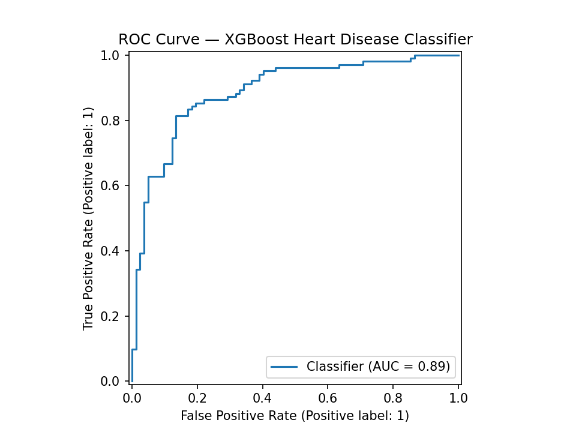
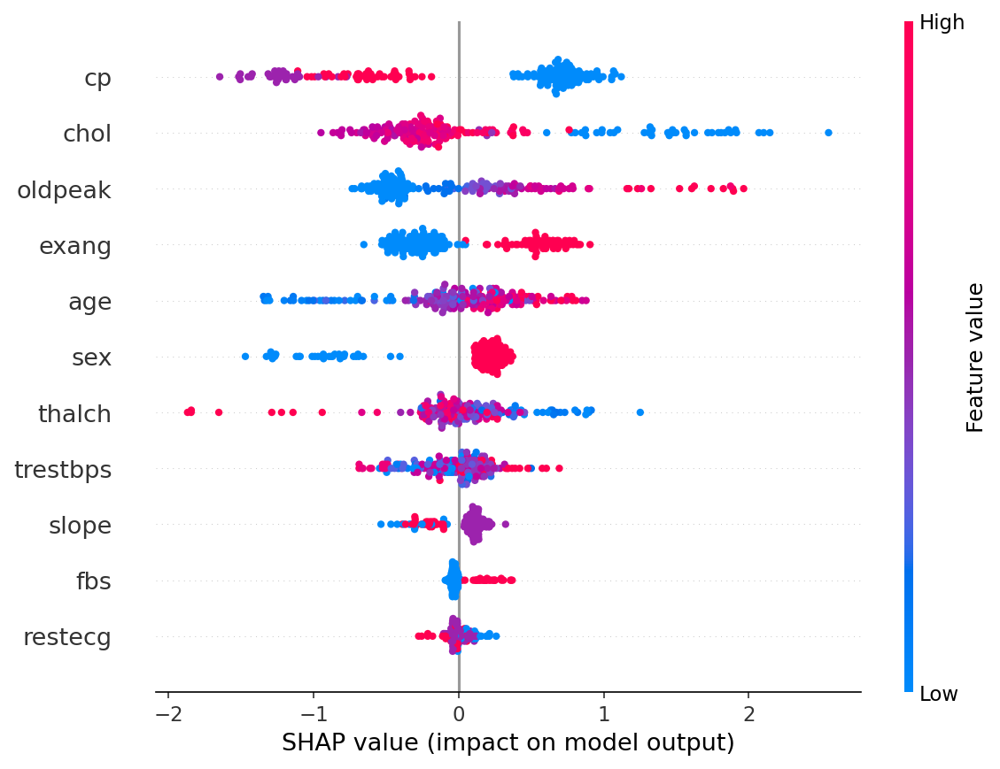
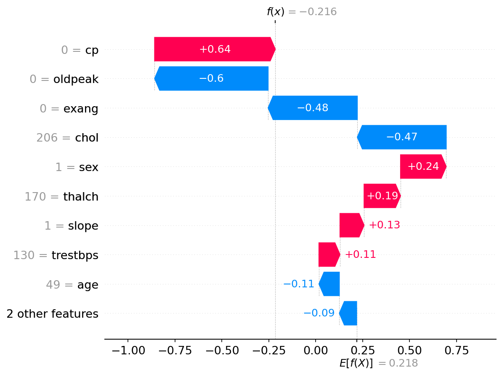

# 🫀 HeartDiseaseXAI: Explainable Heart Disease Risk Classification

> An XGBoost classifier trained on the UCI Heart disease dataset, with SHAP values used to explain every prediction. This project aims to bridge the gap between model accuracy and clinical interpretability.

---

## 📌 Motivation

Accurate predictions alone are not enough in healthcare. Clinicians need to understand **why** a model flags a patient as high risk before acting on it. This project demonstrates how SHAP (SHapley Additive exPlanations) can open the black box of a gradient boosting model and provide feature-level explanations for individual patient predictions.

---

## 🗂️ Project Structure

```
HeartDiseaseXAI/
├── HeartDiseaseXAI.ipynb       # Main notebook (code + explanations)
├── heart_disease_uci.csv       # Dataset
├── roc_curve.png               # ROC curve
├── shap_summary.png            # Global feature importance (SHAP)
├── shap_waterfall.png          # Single patient explanation (SHAP)
└── README.md
```

---

## 🔬 Dataset

**Heart Disease UCI** — aggregated from four clinical databases (Cleveland, Hungary, Switzerland, Long Beach VA).

| Property | Value |
|---|---|
| Samples | 920 |
| Features | 11 clinical measurements |
| Target | Binary (0 = no disease, 1 = disease) |
| Source | [Kaggle](https://www.kaggle.com/datasets/redwankarimsony/heart-disease-uci) |

**Features used:**

| Feature | Description |
|---|---|
| `age` | Age in years |
| `sex` | Male / Female |
| `cp` | Chest pain type (4 types) |
| `trestbps` | Resting blood pressure (mm Hg) |
| `chol` | Cholesterol level (mg/dl) |
| `fbs` | Fasting blood sugar > 120 mg/dl |
| `restecg` | Resting ECG results |
| `thalch` | Maximum heart rate achieved |
| `exang` | Exercise induced chest pain |
| `oldpeak` | ST depression induced by exercise |
| `slope` | Slope of peak exercise ST segment |

---

## 🏗️ Pipeline

```
Raw CSV
   ↓
Data Cleaning (drop nulls, encode categoricals, binarise target)
   ↓
Train/Test Split (80/20, stratified)
   ↓
XGBoost Classifier (n_estimators=200, max_depth=4, lr=0.05)
   ↓
Evaluation (Accuracy, ROC-AUC, Classification Report)
   ↓
SHAP Explainability (Summary Plot + Waterfall Plot)
```

---

## 📊 Results

| Metric | Value |
|---|---|
| Accuracy | 82% |
| ROC-AUC | 0.89 |
| Recall (disease class) | 86% |

### ROC Curve


### SHAP Summary Plot — Global Feature Importance
Each dot represents one patient. Features are ranked by their average impact on model output. Red = high feature value, Blue = low feature value.



**Key findings:**
- `cp` (chest pain type) is the strongest predictor — high chest pain strongly drives disease predictions
- `oldpeak` (ST depression) and `exang` (exercise chest pain) are the next most influential features
- `thalch` (max heart rate) — low values push toward disease, consistent with clinical knowledge

### SHAP Waterfall Plot — Individual Patient Explanation
Explains a single patient's prediction step by step, showing exactly which features pushed the risk up or down.



---

## ⚙️ Getting Started

### Requirements
```
python >= 3.8
xgboost
shap
scikit-learn
pandas
numpy
matplotlib
seaborn
```

Install:
```bash
pip install xgboost shap scikit-learn pandas numpy matplotlib seaborn
```

### Run
```bash
jupyter notebook HeartDiseaseXAI.ipynb
```

---

## 🚀 Extensions & Future Work

| Extension | Description |
|---|---|
| **Hyperparameter tuning** | GridSearchCV or Optuna to push AUC above 0.92 |
| **SHAP dependence plots** | Explore interaction effects between features |
| **Comparison models** | Benchmark XGBoost vs Random Forest vs Logistic Regression |
| **Class imbalance handling** | SMOTE or class weights for better minority class recall |
| **Clinical threshold tuning** | Optimise decision threshold to maximise recall for disease class |

---

## 📄 License

MIT
